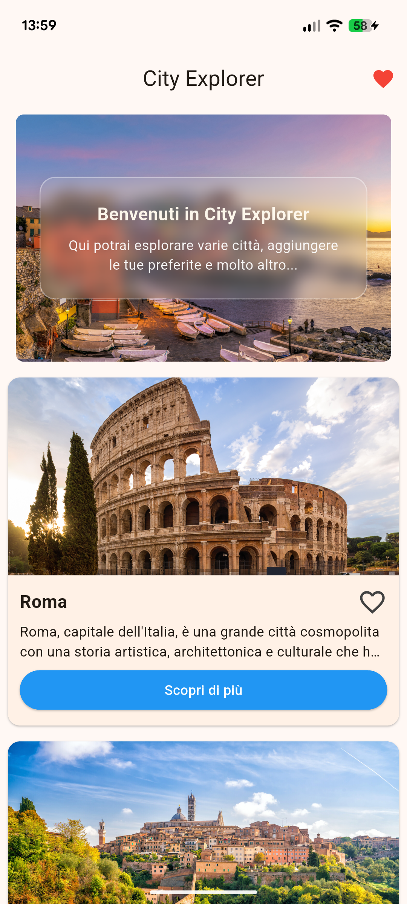
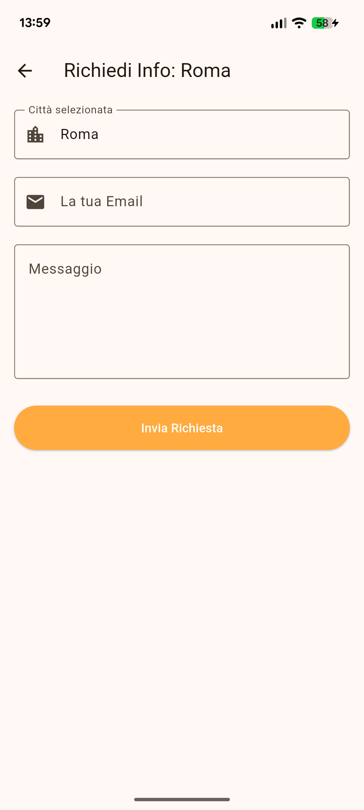

# 🌍 City Explorer App

A dynamic and responsive Flutter application built to showcase beautiful Italian cities. Developed as a core project during an intensive Android Developer Academy, this app highlights modern UI/UX practices, dynamic state management, and seamless cloud database integration.

## ✨ Key Features
* **Cloud Integration (Firebase):** Users can request tour information, which is validated and securely written to a Cloud Firestore database (`richieste_tour` collection) in real-time.
* **Responsive UI:** Implements `LayoutBuilder` to adapt the interface dynamically. It displays a standard `ListView` on mobile screens and switches to a sleek `GridView` on tablets or larger screens (width > 600px).
* **Interactive State Management:** Includes a fully functional "Favorites" system, allowing users to build a custom watchlist of cities.
* **Micro-Animations & Transitions:** Features custom UI elements, such as a pulsing animated favorite icon and smooth `Hero` image transitions between screens.

## 🛠️ Tech Stack
* **Framework:** Flutter
* **Language:** Dart
* **Backend / Database:** Firebase Cloud Firestore
* **Architecture:** Component-based UI with decoupled widgets.


## App Preview
## Android 
    


## Linux 
    


## Chrome 
    


## 🚀 How to run the project
1. Clone the repository:
   ```bash
   git clone [https://github.com/emanuele400tt/explorer-city-app.git](https://github.com/emanuele400tt/explorer-city-app.git)
2. Install dependencies 
    ```bash
    flutter pub get
3. Configure Firebase (required)
    ```bash
    flutterfire configure
4. Run the app 
    ```bash
    flutter run

## 📌 Project Status

> **Maintenance Notice:** This application is a *showcase* project developed for portfolio and technical demonstration purposes. The source code is complete and the app is fully functional, but the repository is **not actively maintained**. Future changes by external API providers (e.g., weather services) may affect data fetching. Feel free to explore the code or test the app via the releases!

---

## 🚀 Download and Installation

You can test the application directly on your device without having to build the code from source. Visit the **[Releases](https://github.com/emanuele400tt/explorer-city-app/releases)** section of this repository to download the latest available version.

### 📱 Android
1. Download the `explorer-city.apk` file to your smartphone.
2. Tap the downloaded file to start the installation. 
3. *Note:* Since this app is downloaded outside of the Google Play Store, your device might ask for permission to "install unknown apps". Confirm to proceed.

### 🐧 Linux
1. Download the compressed archive `explorer-city-linux.zip`.
2. Extract the entire folder to your computer (e.g., on your Desktop).
3. Open the extracted folder and double-click the application executable to launch it. 
   *⚠️ Warning: Do not move the single executable file outside of its folder, as it requires the adjacent libraries and assets to run properly.*

### 🌐 Web Version
*(Se hai caricato i file su un hosting o su GitHub Pages usa questa riga:)*
Don't want to download anything? You can try the app directly from your browser! 
👉 **[Click here to launch the Live Demo](INSERT_SITE_LINK_HERE)**

*(Se invece hai caricato lo zip nella release, usa queste righe:)*
1. Download the `explorer-city-web.zip` archive and extract the folder.
2. *⚠️ Warning:* Due to modern browser security restrictions (CORS policy), you cannot run the app by simply double-clicking the `index.html` file. You need to serve it via a local web server (e.g., using the *Live Server* extension in VS Code or a Python HTTP server) pointing to the extracted folder.

# Versione Italiana

Un'applicazione Flutter dinamica e responsiva creata per esplorare le più belle città italiane. Sviluppata come progetto centrale durante un'Academy per sviluppatori Android, questa app mette in luce l'utilizzo di interfacce moderne, la gestione dello stato e l'integrazione con database in cloud.

## ✨ Funzionalità Principali
* **Integrazione Cloud (Firebase):** Gli utenti possono richiedere informazioni sui tour tramite un form validato. I dati vengono scritti in tempo reale su un database Cloud Firestore (nella collezione `richieste_tour`).
* **Interfaccia Responsiva:** Utilizza `LayoutBuilder` per adattare l'interfaccia. Mostra una classica `ListView` su schermi mobile e passa a una `GridView` strutturata su tablet o schermi larghi (width > 600px).
* **Gestione dello Stato:** Include un sistema di "Preferiti" funzionante, che permette agli utenti di salvare e visualizzare una lista personalizzata di città.
* **Micro-Animazioni e Transizioni:** Presenta elementi UI personalizzati, come un'icona dei preferiti animata e transizioni fluide delle immagini tramite il widget `Hero`.

## 🛠️ Stack Tecnologico
* **Framework:** Flutter
* **Linguaggio:** Dart
* **Backend / Database:** Firebase Cloud Firestore
* **Architettura:** UI basata su componenti e widget modulari.

## 🚀 Come lanciare il progetto
1. Clonare il repository:
   ```bash
   git clone [https://github.com/emanuele400tt/explorer-city-app.git](https://github.com/emanuele400tt/explorer-city-app.git)
2. Installa le dipendenze 
    ```bash
    flutter pub get
3. Configurazione firebase (necessario)
    ```bash
    flutterfire configure
4. Avvia l'app
    ```bash
    flutter run


## 📌 Stato del Progetto

> **Avviso di Manutenzione:** Questa applicazione è un progetto *showcase* sviluppato a scopo di portfolio e dimostrazione tecnica. Il codice sorgente è completo e l'app è funzionante, ma il repository **non è attivamente mantenuto**. Eventuali modifiche future da parte dei provider delle API esterne (es. i servizi meteo) potrebbero influire sul caricamento dei dati. Sentiti libero di esplorare il codice o testare l'app tramite le release!

---
    
## 🚀 Download e Installazione

Puoi testare l'applicazione direttamente sul tuo dispositivo senza dover compilare il codice. Visita la sezione **[Releases](https://github.com/emanuele400tt/explorer-city-app/releases)** di questo repository per scaricare l'ultima versione disponibile.

### 📱 Android
1. Scarica il file `explorer-city.apk` sul tuo smartphone.
2. Fai tap sul file scaricato per avviare l'installazione. 
3. *Nota:* Essendo un'app scaricata al di fuori del Google Play Store, il tuo dispositivo potrebbe chiederti l'autorizzazione per "installare app da fonti sconosciute". Conferma per procedere.

### 🐧 Linux
1. Scarica l'archivio compresso `explorer-city-linux.zip`.
2. Estrai l'intera cartella sul tuo computer (ad esempio, sul Desktop).
3. Apri la cartella estratta e fai doppio click sul file eseguibile dell'applicazione per avviarla. 
   *⚠️ Attenzione: non spostare il singolo file eseguibile al di fuori di quella cartella, poiché necessita delle librerie e degli assets adiacenti per funzionare correttamente.*

### 🌐 Versione Web
*(Se hai caricato i file su un hosting o su GitHub Pages usa questa riga:)*
Non vuoi scaricare nulla? Puoi provare l'interfaccia dell'app direttamente dal tuo browser! 
👉 **[Clicca qui per avviare la Live Demo](INSERISCI_QUI_IL_LINK_DEL_SITO)**

*(Se invece hai caricato lo zip nella release, usa queste righe:)*
1. Scarica l'archivio `explorer-city-web.zip` ed estrai la cartella.
2. *⚠️ Attenzione:* A causa delle restrizioni di sicurezza dei browser moderni (CORS), non è possibile eseguire l'app facendo semplicemente doppio click sul file `index.html`. È necessario avviare un server locale (ad es. tramite l'estensione *Live Server* su VS Code o con un server HTTP Python) puntando alla cartella estratta.
    
